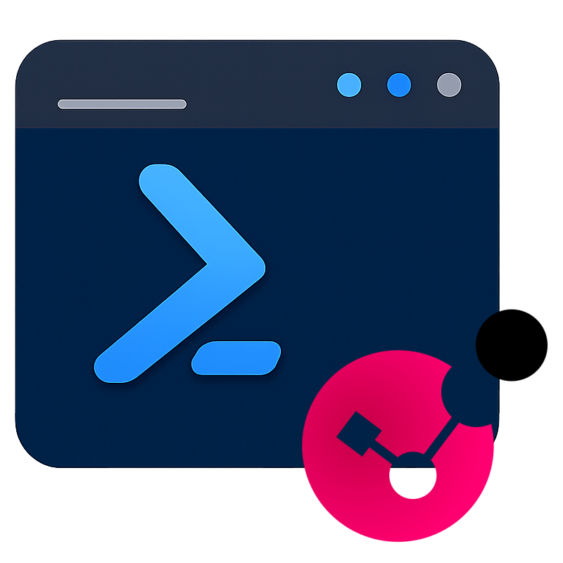

# Start-PSCheckPointShell

<div>
  

  A PowerShell interactive shell for managing Check Point firewalls via the Management API and cprid_util. Provides a rich set of commands for object management, policy deployment, gateway diagnostics, and more.

  
  
  
</div>
<br clear="left" />

## Features

- **Interactive Shell** for Check Point management with auto-connection on startup
- **Management API** integration for object CRUD, policy installation, session management
- **cprid_util** commands for gateway diagnostics (routing, interfaces, firmware, Jumbo Hotfix, etc.)
- **dbedit** support for direct database queries
- **Network Objects**: hosts, networks, address ranges, groups, DNS domains, interoperable devices
- **Services**: TCP, UDP, and service groups management
- **Policy**: policy packages, access layers, rule bases
- **Gateway**: platform info, public interfaces, cluster details
- **Cloud**: AWS and Azure metadata retrieval from gateways
- **Multi-management**: connect to multiple management servers simultaneously
- **Configuration persistence**: save and reload management connections

## Requirements

- Windows 10/11
- PowerShell 5.1 or later
- Network access to Check Point Management API (default port 4434)
- Check Point management credentials

## Quick Start

1. Run the shell:
   ```powershell
   .\Start-PSCheckPointShell.ps1
   ```

2. Connect to a management server:
   ```powershell
   Connect-ManagementCUI
   ```

3. Save the configuration for next time:
   ```powershell
   Save-Config
   ```

4. List available commands:
   ```powershell
   Get-CheckPointCommands
   ```

## Configuration

The shell loads its configuration from `config.json` in the input directory. The configuration file stores the list of management servers to connect to on startup.

Example `config.json`:
```json
{
  "Managements": [
    "mgmt-server.domain.local:4434"
  ]
}
```

## Built-in Commands

| Command | Description |
|---------|-------------|
| `Connect-ManagementCUI` | Interactive connection to management servers |
| `Save-Config` | Save current connections to config file |
| `Get-CheckPointCommands` | List all available Check Point commands with synopsis |

## Project Structure

```
Start-PSCheckPointShell/
├── Start-PSCheckPointShell.ps1   # Main shell script
├── icon.png                      # Application icon
├── input/                        # Configuration files
│   └── config.json
└── UDF/                          # PowerShell modules
    ├── PSSomeAPIThings/          # API utilities
    ├── PSSomeCheckPointNPMThings/# Check Point Management API & cprid_util
    ├── PSSomeCLIThings/          # CLI dialog framework
    ├── PSSomeCoreThings/         # Core utilities
    ├── PSSomeDataThings/         # Data manipulation
    ├── PSSomeFileThings/         # File utilities
    └── PSSomeNetworkThings/      # Network utilities (IP, DNS, regex)
```

## Disclaimer

This project is not affiliated with, endorsed by, or associated with Check Point Software Technologies Ltd. Check Point is a registered trademark of Check Point Software Technologies Ltd. This tool is an independent project developed to facilitate Check Point management operations.

## Author

**Loic Ade**

## License

This project is licensed under the [PolyForm Noncommercial License 1.0.0](https://polyformproject.org/licenses/noncommercial/1.0.0/). See the [LICENSE](LICENSE) file for details.

In short:
- **Non-commercial use only** &mdash; You may use, modify, and distribute this software for any non-commercial purpose.
- **Attribution required** &mdash; You must include a copy of the license terms with any distribution.
- **No warranty** &mdash; The software is provided as-is.
